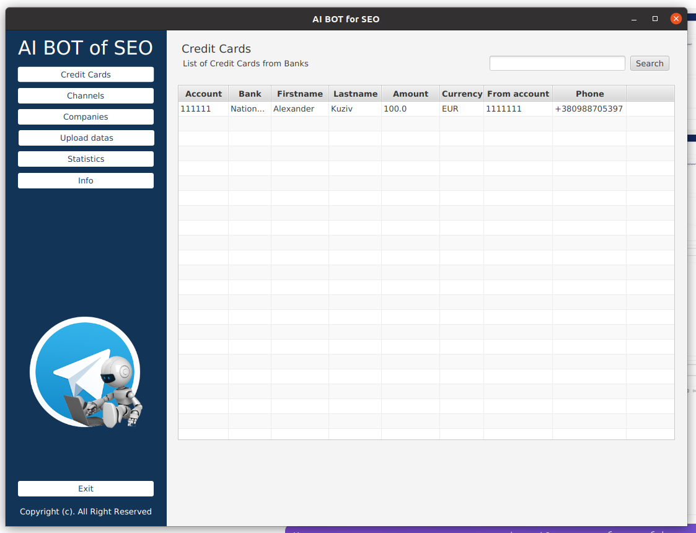
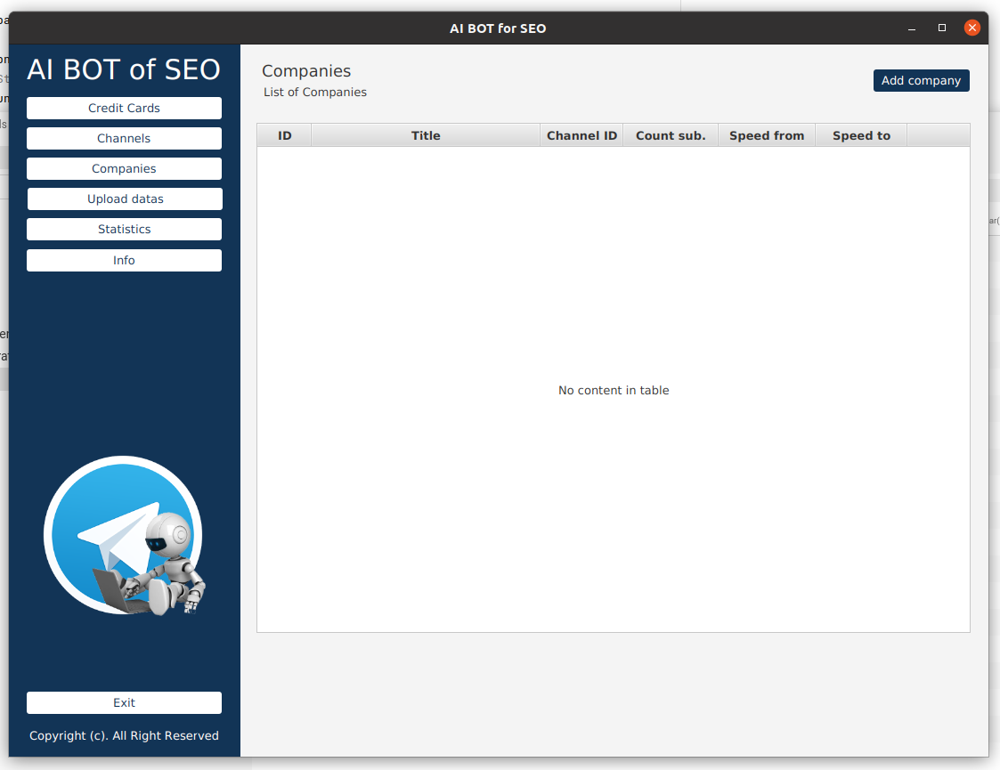
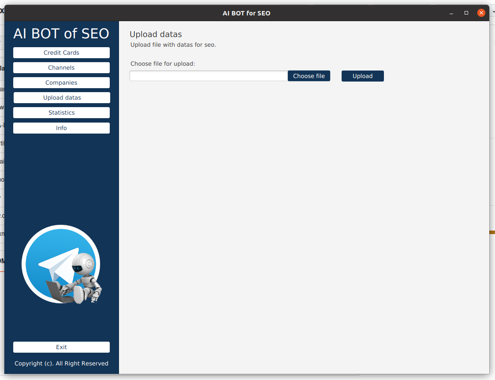
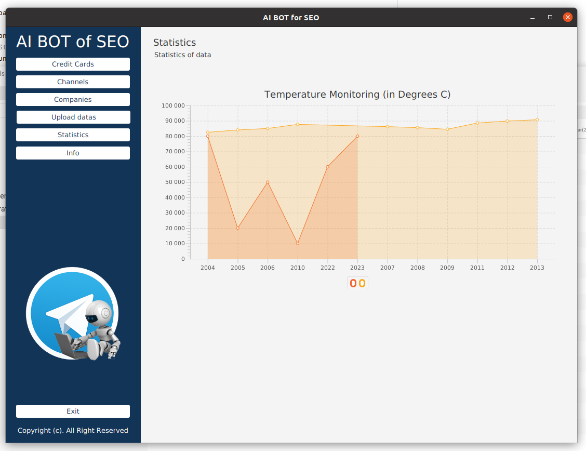

# JAVAFX 👨‍💻

This is a <b>JavaFX</b> project with sample code to demonstrate my knowledge and tech skills.

This is a simple <b>desktop program</b> with several windows for a list of <b>Telegrams channels</b> and SEO optimization. 

    
    

    
    

    
    

    

